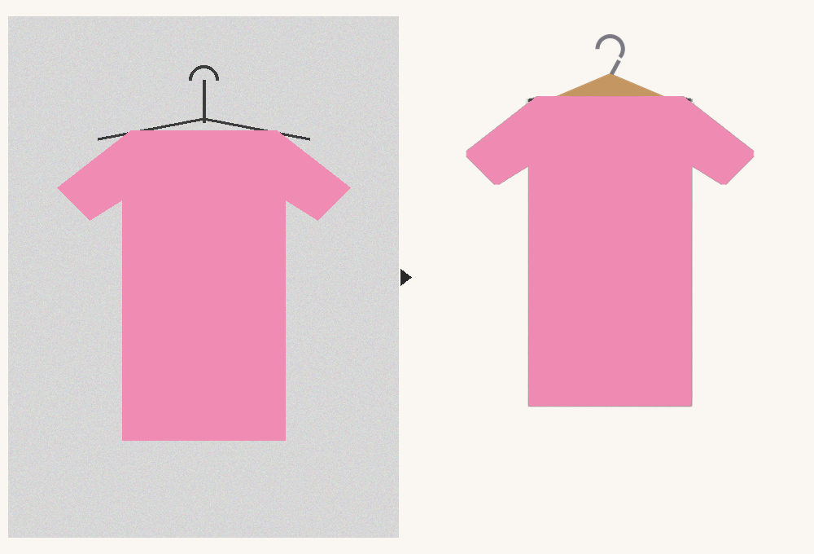

# closet-vision 👗

Photo of a clothing item in → **clean cut-out on a hanger** + **suggested tags** out.



Built for [cyber-wardrobe](https://github.com/lopengil/cyber-wardrobe) (a
*Clueless*-style closet screen), but it's a standalone library, CLI and HTTP
API you can use in any closet / resale / styling project.

## What you get

| Field | How |
|---|---|
| `cutout` | background removed with [rembg](https://github.com/danielgatis/rembg) (IS-Net by default, U²-Net-p for small devices), specks dropped, the hanger in your photo trimmed off |
| `hanger` | the cut-out hung on a drawn wooden hanger (clip hanger for skirts/trousers, shelf shadow for shoes and bags) |
| `slot`, `kind` | zero-shot with [FashionCLIP](https://huggingface.co/patrickjohncyh/fashion-clip) over ~60 garment types (`taxonomy.py`) |
| `colors` | k-means on the cut-out's pixels in Lab space → names like burgundy, camel, denim |
| `pattern`, `material`, `styles` | FashionCLIP again, with prompts conditioned on the detected kind |
| `formality`, `warmth`, `waterproof` | defaults per kind, nudged by material and style |
| `confidence`, `alternatives` | so a UI can ask the human to approve or correct |

No training needed. Every label lives in `closet_vision/taxonomy.py`, so you
can add a garment type by adding one line.

## Use it

```bash
pip install "closet-vision[tagger] @ git+https://github.com/lopengil/closet-vision.git"
# CPU-only torch is much smaller: pip install torch --index-url https://download.pytorch.org/whl/cpu

closet-vision process skirt.jpg jacket.jpg --out results/
# results/skirt.cutout.png  results/skirt.hanger.png  results/skirt.json
```

```python
from closet_vision import process, load_tagger

tagger = load_tagger()                 # FashionCLIP, ~600 MB download once
r = process("skirt.jpg", tagger)
r.hanger.save("skirt_on_hanger.png")
print(r.suggestion)
# Suggestion(name='Burgundy leather mini skirt', slot='bottom', kind='skirt',
#            colors=['burgundy'], pattern='solid', material='leather', ...)
```

Only need the cut-out and colours (tiny, fast, works on a Raspberry Pi)?
Skip `[tagger]` and call `process("skirt.jpg", None, model="u2netp")`.

## HTTP API

```bash
pip install "closet-vision[tagger,server] @ git+https://github.com/lopengil/closet-vision.git"
closet-vision serve --port 7860
curl -F photo=@skirt.jpg http://localhost:7860/process
```

Returns `{"cutout_png": <base64>, "hanger_png": <base64>, "suggestion": {...}}`.
Open `http://localhost:7860/` for a tiny upload demo.

Environment: `CLOSET_VISION_MODEL` (any CLIP model id), `CLOSET_VISION_SEG`
(rembg model, e.g. `u2netp`), `CLOSET_VISION_TAGGER=off` (cut-out + colours only).

## Put it on Hugging Face

`space/` has a ready Docker Space: create a new Space (SDK: Docker), copy
`space/README.md` and `space/Dockerfile` into it, push. Your Space then serves
the same `/process` API for free on CPU, which is handy when the device using
it (like a Pi Zero) is too small to run the models itself.

## Photo tips

One item per photo, on a hanger or laid flat, against a plain wall or bed sheet
that contrasts with the garment. Daylight beats flash.

## Develop

```bash
python -m venv .venv && . .venv/bin/activate
pip install -e ".[dev]"
pytest -q              # fast tests, no downloads
pytest -q -m models    # real rembg + FashionCLIP (downloads models)
```

## Credits & licenses

MIT. Models keep their own licenses: rembg/IS-Net/U²-Net (see rembg),
FashionCLIP (see its model card).
